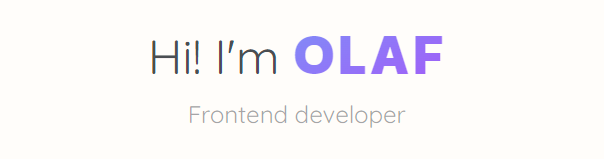

    
    

        
        
        
        
         
    

     
    

        👋 Hi! My name is <strong>Olaf</strong> and I'm 18-year-old developer from Poland, who has been in contact with programming in various forms since childhood. Currently, I'm focused on Frontend, and I'm excited to continue developing my skills in this area. I enjoy working on my personal coding projects and exploring new technologies. I'm constantly challenging myself to learn new things and improve my knowledge. 
          
        <h4>Check out my <a href="www.narei.me">personal website</a>! 👀</h4>
    

    

